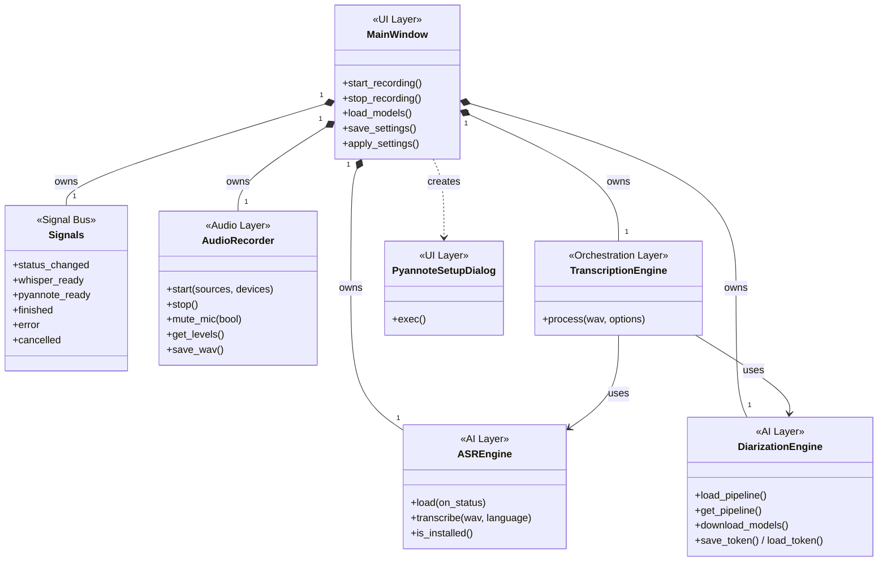
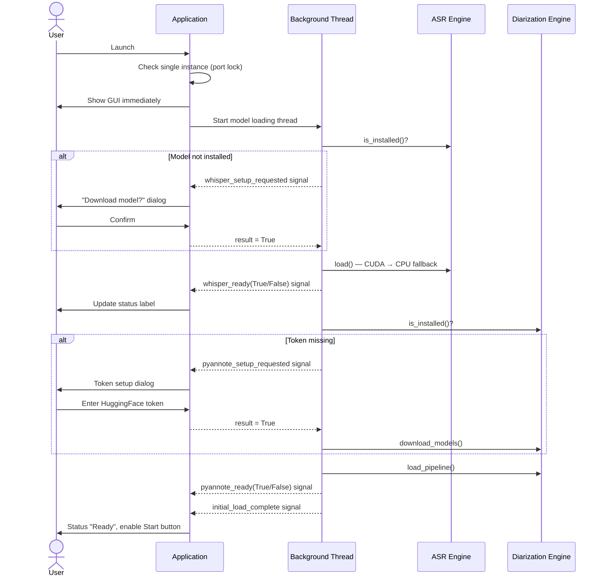
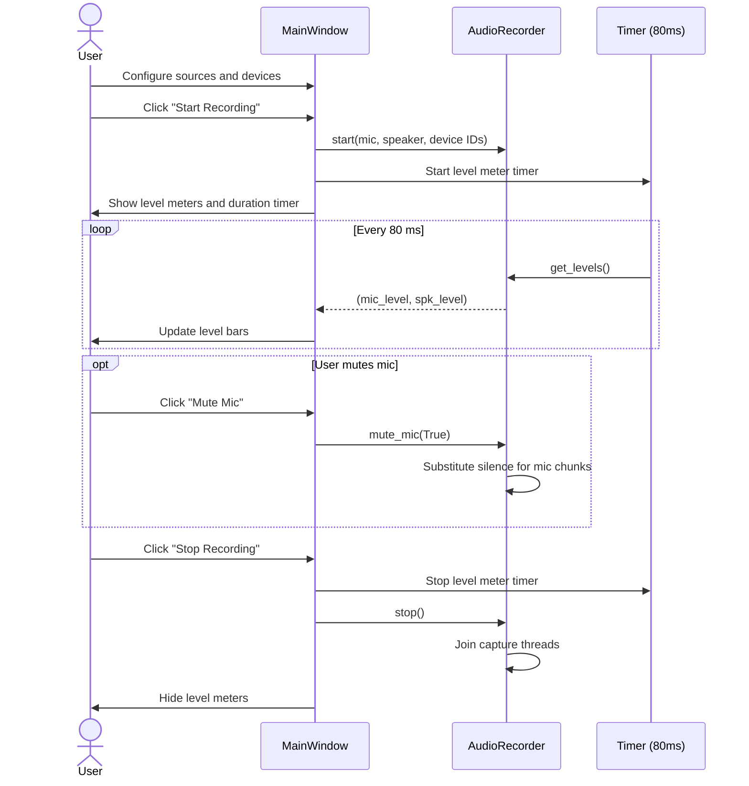
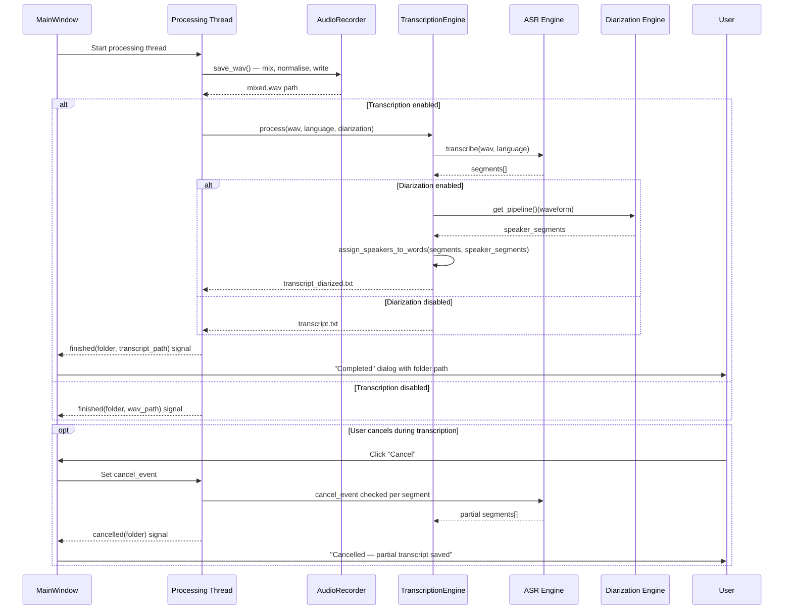
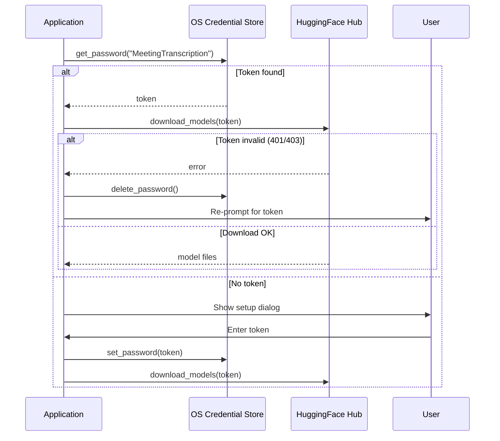

# Software Architecture
## Meeting Transcriber v1.0.0

---

## 1. Overview

Meeting Transcriber is a single-process desktop application built on a layered component model. The GUI layer handles all user interaction and delegates work to specialised domain components that run in background threads. Cross-thread communication is handled exclusively through a typed signal bus, keeping the domain layer independent of the UI framework.

---

## 2. Static View — Component Architecture

### 2.1 Component Map

### 2.2 Component Responsibilities

| Component | Layer | Responsibility |
|---|---|---|
| **MainWindow** | UI | User interaction, control state, background thread orchestration, settings I/O |
| **Signals** | Signal Bus | Typed Qt signals for safe cross-thread UI updates; decouples background threads from UI widgets |
| **AudioRecorder** | Audio | Parallel mic + speaker capture on dedicated threads; audio mixing, normalisation, WAV export |
| **ASREngine** | AI | Whisper model lifecycle (download, load, transcribe); GPU→CPU fallback |
| **DiarizationEngine** | AI | pyannote pipeline lifecycle; HuggingFace token management; speaker segmentation |
| **TranscriptionEngine** | Orchestration | Coordinates ASR + diarization; speaker-to-word assignment; transcript file generation |
| **PyannoteSetupDialog** | UI | One-shot dialog for HuggingFace token entry and model download |

### 2.3 Key Relationships

- **Composition** (`MainWindow` → core components): `MainWindow` owns and controls the lifecycle of all domain components.
- **Dependency** (`TranscriptionEngine` → AI engines): `TranscriptionEngine` receives both AI engine instances at construction (dependency injection) and uses them to produce transcripts.
- **Signal Bus** (`Signals`): background threads emit signals; Qt dispatches them to the main thread where UI updates occur. No direct references from threads to UI widgets.

---

## 3. Dynamic View — Interaction Flows

### 3.1 Application Startup

### 3.2 Recording Session

### 3.3 Transcription & Diarization Pipeline

### 3.4 Token Management Flow

---

## 4. Cross-Cutting Concerns

### 4.1 Thread Safety
All background threads communicate with the UI exclusively via Qt signals. No background thread holds a direct reference to a UI widget. The `Signals` object is created on the main thread and passed to background operations.

### 4.2 Logging
All components write to a shared daily log file via the standard Python `logging` module. A global `sys.excepthook` ensures unhandled exceptions are logged before the process exits.

### 4.3 Single Instance
A local TCP socket bound to a fixed port at startup acts as a process-level lock. A second launch detects the occupied port and exits with a user-facing message.

### 4.4 Settings Persistence
UI state is serialised to `settings.json` on window close and reloaded at startup. Application parameters are read from `config.json` once at startup and treated as immutable for the process lifetime.
