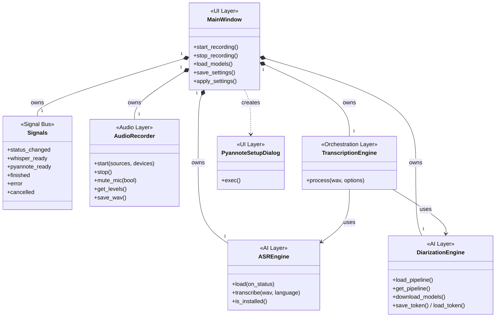
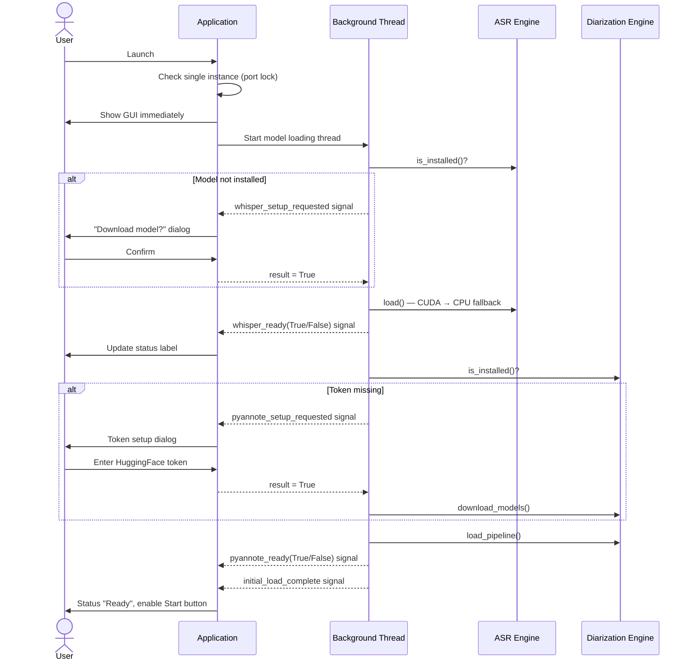
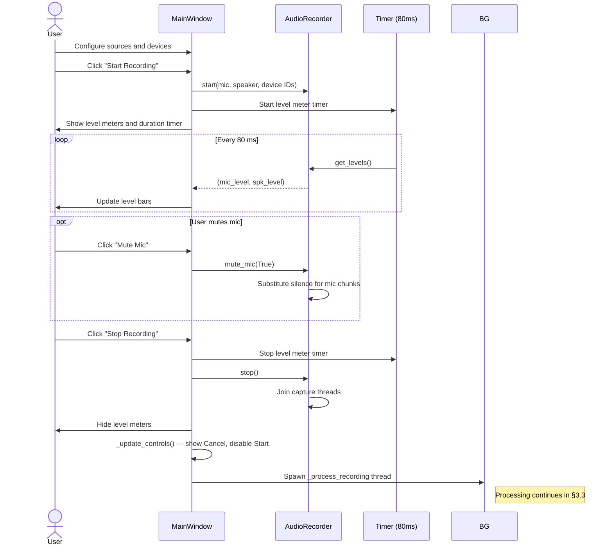
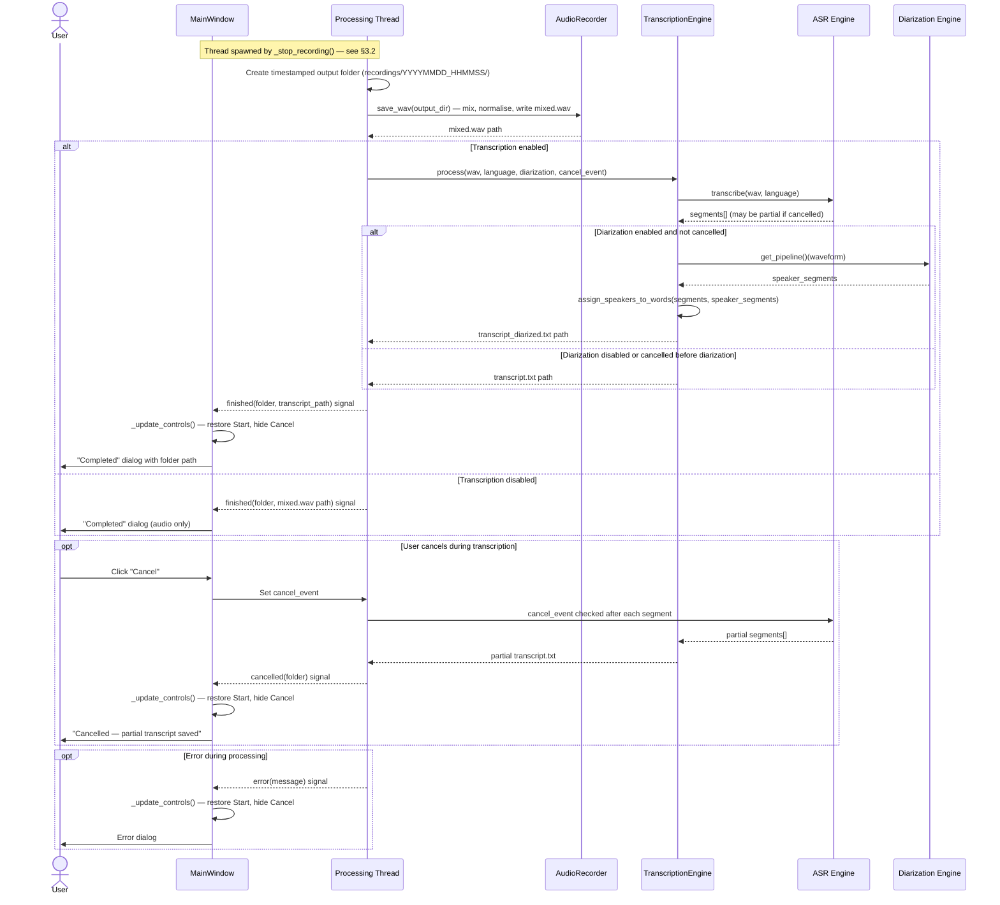
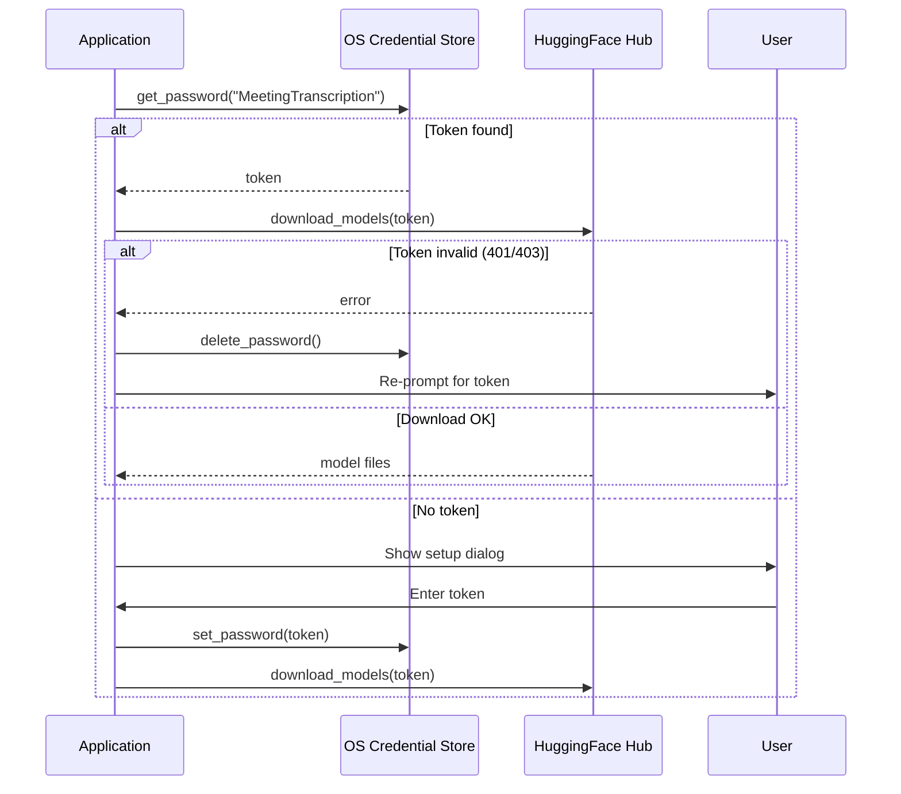
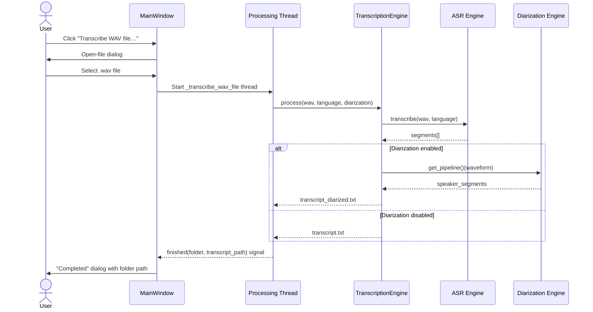

# Software Architecture
## Meeting Transcriber v1.0.0

---

## 1. Overview

Meeting Transcriber is a single-process desktop application built on a layered component model. The GUI layer handles all user interaction and delegates work to specialised domain components that run in background threads. Cross-thread communication is handled exclusively through a typed signal bus, keeping the domain layer independent of the UI framework.

---

## 2. Static View — Component Architecture

### 2.1 Component Map

### 2.2 Component Responsibilities

The **Component Design §** column references the corresponding section in `COMPONENT_DESIGN.md` (abbreviated **CD**).

| Component | Layer | Responsibility | Component Design § |
|---|---|---|---|
| **MainWindow** | UI | User interaction, control state, background thread orchestration, settings I/O | CD §8 |
| **Signals** | Signal Bus | Typed Qt signals for safe cross-thread UI updates; decouples background threads from UI widgets | CD §2 |
| **AudioRecorder** | Audio | Parallel mic + speaker capture on dedicated threads; audio mixing, normalisation, WAV export | CD §5 |
| **ASREngine** | AI | Whisper model lifecycle (download, load, transcribe); GPU→CPU fallback | CD §3 (`WhisperManager`) |
| **DiarizationEngine** | AI | pyannote pipeline lifecycle; HuggingFace token management; speaker segmentation | CD §4 (`PyannoteManager`) |
| **TranscriptionEngine** | Orchestration | Coordinates ASR + diarization; speaker-to-word assignment; transcript file generation | CD §6 |
| **PyannoteSetupDialog** | UI | One-shot dialog for HuggingFace token entry and model download | CD §7 |

> **Note on naming**: `ASREngine` and `DiarizationEngine` are the logical names used at architecture level. Their concrete implementations are `WhisperManager` and `PyannoteManager` respectively.

### 2.3 Key Relationships

- **Composition** (`MainWindow` → core components): `MainWindow` owns and controls the lifecycle of all domain components. Concrete instance attributes are in CD §8.1; the initialisation sequence is in CD §8.2.
- **Dependency** (`TranscriptionEngine` → AI engines): `TranscriptionEngine` receives both AI engine instances at construction (dependency injection) and uses them to produce transcripts. See CD §6.1 constructor.
- **Signal Bus** (`Signals`): background threads emit signals; Qt dispatches them to the main thread where UI updates occur. No direct references from threads to UI widgets. Full signal inventory is in CD §2.1; slot wiring is in CD §8.3 `_connect_signals()`.

---

## 3. Dynamic View — Interaction Flows

### 3.1 Application Startup

### 3.2 Recording Session

### 3.3 Transcription & Diarization Pipeline

This flow begins immediately after the processing thread is spawned at the end of §3.2.

### 3.4 Token Management Flow

### 3.5 WAV File Transcription

A pre-recorded audio file can be transcribed without starting a new recording session (F-16). `MainWindow` presents a file-open dialog and delegates directly to `TranscriptionEngine`, bypassing `AudioRecorder`.

---

## 4. Cross-Cutting Concerns

### 4.1 Thread Safety
All background threads communicate with the UI exclusively via Qt signals. No background thread holds a direct reference to a UI widget. The `Signals` object is created on the main thread and passed to background operations. The `messagebox_requested` signal (CD §2.1) extends this pattern to allow background threads to trigger modal dialogs without touching Qt widgets directly. See CD §2.1 for the full signal inventory and CD §8.3 for slot wiring.

### 4.2 Logging
All components write to a shared daily log file via the standard Python `logging` module. A global `sys.excepthook` ensures unhandled exceptions are logged before the process exits (NF-05, NF-06). Sensitive values (tokens, credentials) are never passed to log calls — they are referenced only inside `DiarizationEngine.save_token` / `load_token` which write nothing to the log (NF-10).

### 4.3 Single Instance
A local TCP socket bound to a fixed port at startup acts as a process-level lock. A second launch detects the occupied port and exits with a user-facing message.

### 4.4 Settings Persistence
UI state is serialised to `settings.json` on window close and reloaded at startup. Application parameters are read from `config.json` once at startup and treated as immutable for the process lifetime (F-32, F-33).

### 4.5 Startup Performance
To satisfy NF-01 (GUI visible within 2 seconds), all heavyweight libraries are imported lazily inside the first method that needs them rather than at module level:

| Library | Imported inside | Component Design § |
|---|---|---|
| `faster_whisper.WhisperModel` | `WhisperManager.load()` | CD §3.2 |
| `pyannote.audio.Pipeline` | `PyannoteManager._initialize_pipeline()`, `download_models()` | CD §4.2 |
| `torch` | `PyannoteManager._initialize_pipeline()`, `TranscriptionEngine._run_diarization()` | CD §4.2, CD §6.2 |
| `soundcard` | `AudioRecorder._record_speaker()`, `_record_microphone()` | CD §5.2 |

The GUI window is rendered and shown before any model loading begins. The background model-loading thread is started after the window is visible.

### 4.6 UI State Management
`MainWindow._update_controls()` is invoked on every state change and enforces the following rules:

| Rule | Requirement |
|---|---|
| **Start** enabled only when ≥ 1 source checked, models ready, no active recording | F-09 |
| **Diarization** checkbox enabled only when **Transcription** is also checked | F-19 |
| **Cancel** visible only during active transcription/processing | F-14 |
| **Mute Mic** enabled only during active recording with mic source on | F-06 |
| Device combo boxes disabled during active recording | NF-12 |
| Install buttons re-enabled whenever models are missing or failed to load | F-31 |

This ensures controls that are inapplicable in the current state are always visually disabled (NF-12).

### 4.7 Application Icon
A multi-resolution icon (16 × 16, 32 × 32, 48 × 48, 64 × 64 px) is generated at application startup by `_make_app_icon()` using `QPainter`. No external image files are bundled. The icon is applied to both the `QApplication` instance and `MainWindow`, so it appears in the taskbar, title bar, and Alt+Tab switcher (NF-13).

---

## 5. Requirements Traceability

This section traces every requirement from the SRS (excluding hardware/OS prerequisites in SRS §2) to the architecture component or cross-cutting concern that implements it.

The **Architecture Ref** column contains section numbers within *this document*: for example `§3.3` means section 3.3 of this Architecture document (the Transcription & Diarization Pipeline sequence diagram).

### 5.1 Functional Requirements

| Req ID | Summary | Component(s) | Architecture Ref |
|---|---|---|---|
| F-01 | Record from microphone | AudioRecorder | §2.2, §3.2 |
| F-02 | Record speaker loopback | AudioRecorder | §2.2, §3.2 |
| F-03 | Enable/disable each audio source | MainWindow, AudioRecorder | §2.2, §3.2 |
| F-04 | Select specific microphone device | MainWindow, AudioRecorder | §2.2, §3.2 |
| F-05 | Select specific speaker device | MainWindow, AudioRecorder | §2.2, §3.2 |
| F-06 | Mute microphone during recording | MainWindow, AudioRecorder | §3.2, §4.6 |
| F-07 | Real-time audio level indicators | MainWindow, AudioRecorder | §3.2 |
| F-08 | Elapsed recording timer | MainWindow | §3.2 |
| F-09 | Require at least one active source | MainWindow | §4.6 |
| F-10 | Automatic speech transcription | ASREngine, TranscriptionEngine | §2.2, §3.3 |
| F-11 | Enable/disable transcription | MainWindow, TranscriptionEngine | §2.2, §3.3 |
| F-12 | Transcription language selection | MainWindow | §2.2 |
| F-13 | Supported languages (IT, EN, FR, auto) | MainWindow | §2.2 |
| F-14 | Cancel in-progress transcription | MainWindow, Signals | §3.3 |
| F-15 | Partial transcript on cancellation | ASREngine, TranscriptionEngine | §3.3 |
| F-16 | Transcribe a pre-existing WAV file | MainWindow, TranscriptionEngine | §3.5 |
| F-17 | Identify and label speakers | DiarizationEngine, TranscriptionEngine | §2.2, §3.3 |
| F-18 | Enable/disable speaker identification | MainWindow | §2.2, §4.6 |
| F-19 | Diarization requires transcription | MainWindow | §4.6 |
| F-20 | Speaker-to-word assignment | TranscriptionEngine | §3.3 |
| F-21 | Session saved in timestamped folder | MainWindow | §3.3 |
| F-22 | Transcript file with timestamps | TranscriptionEngine | §3.3 |
| F-23 | Diarized transcript with speaker labels | TranscriptionEngine | §3.3 |
| F-24 | Audio saved alongside transcripts | AudioRecorder, MainWindow | §3.3 |
| F-25 | Existing output files never overwritten | TranscriptionEngine | §3.3 |
| F-26 | Prompt to download Whisper on first run | MainWindow, Signals | §3.1 |
| F-27 | Auto-download pyannote if token present | MainWindow, DiarizationEngine | §3.1 |
| F-28 | Guided token entry procedure | PyannoteSetupDialog | §3.1, §3.4 |
| F-29 | Validate token before model download | DiarizationEngine | §3.4 |
| F-30 | Discard invalid/revoked token | DiarizationEngine | §3.4 |
| F-31 | Manual model re-installation | MainWindow | §3.1, §4.6 |
| F-32 | Restore UI preferences at startup | MainWindow | §4.4 |
| F-33 | Configurable parameters via plain-text file | MainWindow (startup) | §4.4 |
| F-34 | Secure token storage in OS credential store | DiarizationEngine | §3.4 |

### 5.2 Non-Functional Requirements

| Req ID | Summary | Component(s) | Architecture Ref |
|---|---|---|---|
| NF-01 | GUI appears within 2 seconds of launch | MainWindow, all AI components (lazy imports) | §4.5 |
| NF-02 | Level indicators update ≤ 100 ms | MainWindow (80 ms timer), AudioRecorder | §3.2 |
| NF-03 | GPU acceleration where available | ASREngine, DiarizationEngine | §3.1 |
| NF-04 | Automatic CPU fallback if no GPU | ASREngine | §3.1 |
| NF-05 | Log all errors to daily log files | All components (shared logger) | §4.2 |
| NF-06 | Capture unhandled exceptions | `sys.excepthook` (module level) | §4.2 |
| NF-07 | Device failure does not discard captured audio | AudioRecorder | §3.3 |
| NF-08 | Notify user of audio device failures | AudioRecorder, Signals, MainWindow | §3.3 |
| NF-09 | Token not stored in plain text (if keyring available) | DiarizationEngine | §3.4 |
| NF-10 | No sensitive data in log files | DiarizationEngine | §4.2 |
| NF-11 | Single application instance | MainWindow (port lock) | §4.3 |
| NF-12 | Inapplicable controls visually disabled | MainWindow | §4.6 |
| NF-13 | Recognisable taskbar and title bar icon | `_make_app_icon()` | §4.7 |

### 5.3 Constraints

| Req ID | Constraint | Impacted Component(s) | Notes |
|---|---|---|---|
| C-01 | Speaker loopback is Windows-only | AudioRecorder | Uses Windows WASAPI via `soundcard`; loopback API not available on other OS |
| C-02 | Requires Python 3.10 or later | All | Use of `match` syntax, `Path` improvements, and type-union hints (`X \| Y`) |
| C-03 | GPU requires NVIDIA + compatible driver | ASREngine, DiarizationEngine | CUDA path set via `os.add_dll_directory`; non-NVIDIA GPUs ignored |
| C-04 | pyannote models require HuggingFace license acceptance | DiarizationEngine, PyannoteSetupDialog | Download blocked by HuggingFace until user accepts terms via web UI |
